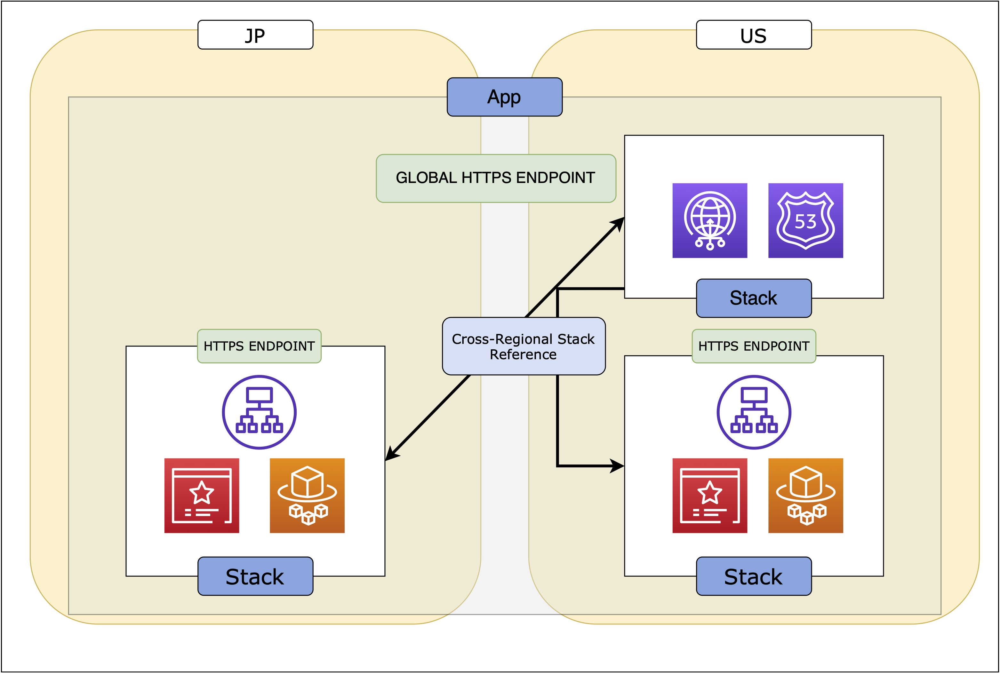

# Fargate Global

`fargate-global` is a CDK app that provisions multi-regional AWS Fargate services with [AWS Global Accelerator](https://aws.amazon.com/global-accelerator).



## Deploy

```bash
# to see what's going to be created
$ cdk diff
# deploy it
$ cdk deploy
# destroy it
$ cdk destroy
```
